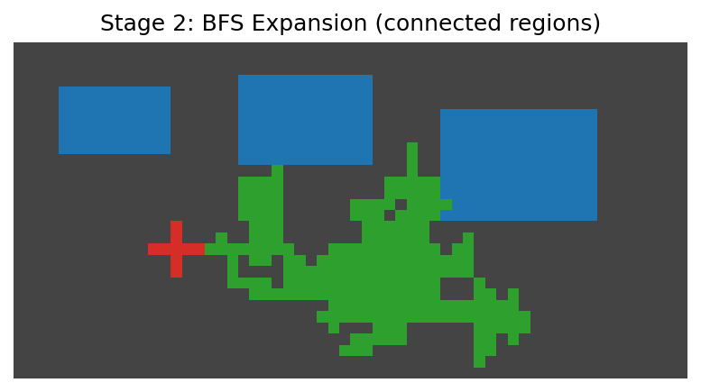
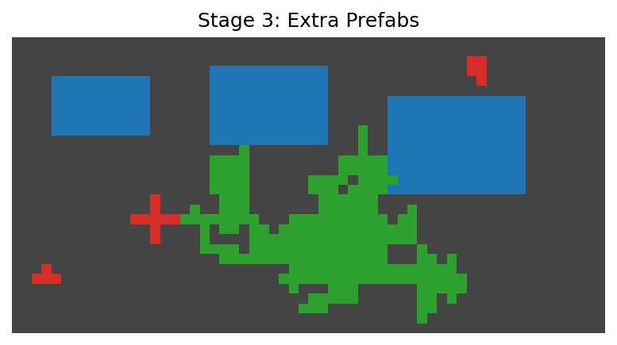
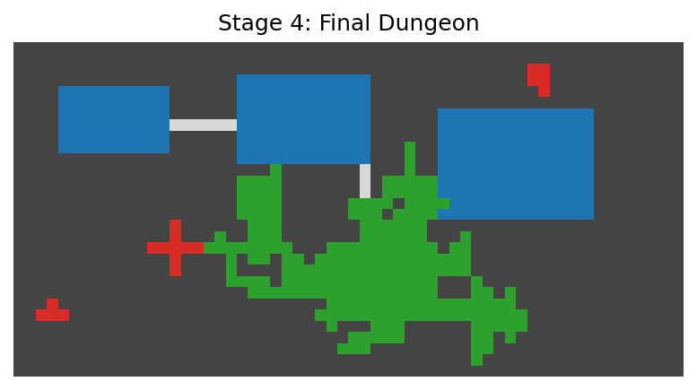
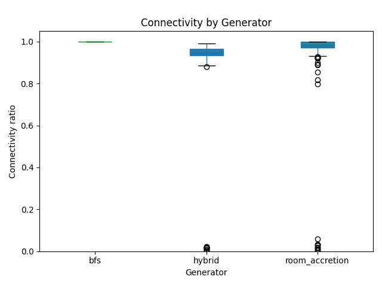
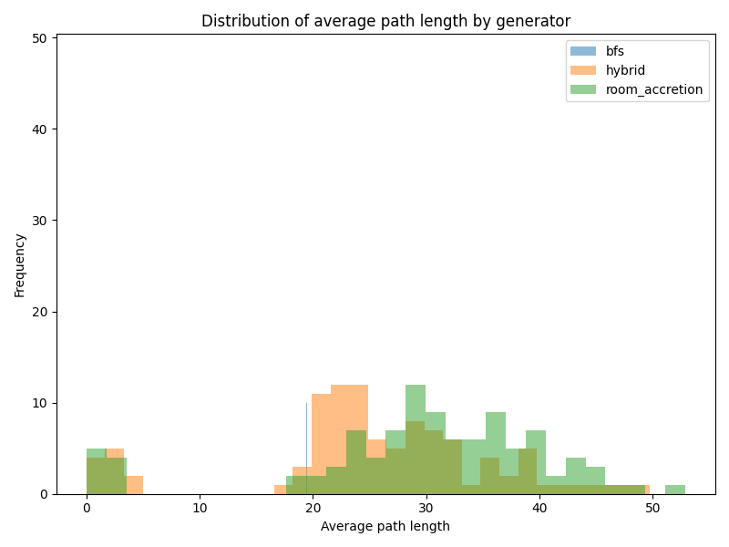
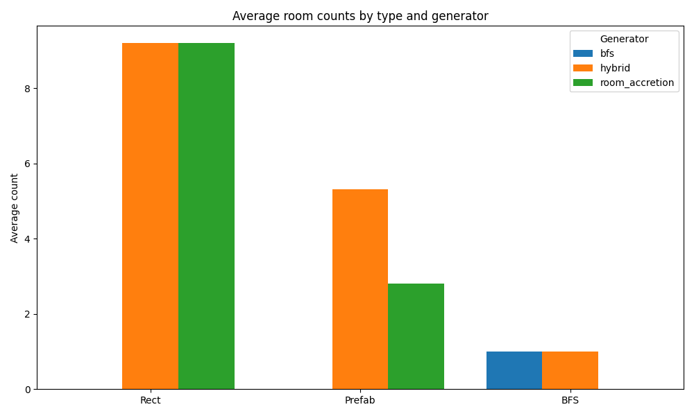
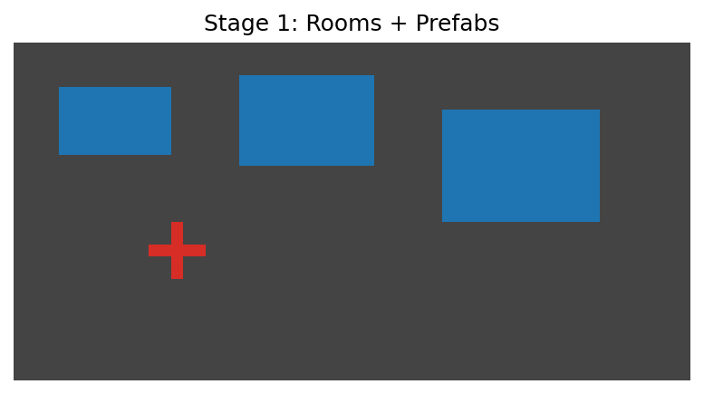

# Procedural Dungeon Generator 🏰

This project implements a **multi-stage hybrid dungeon generator** that combines:
- **Rectangular Rooms** (structured layout)
- **Prefab Structures** (handcrafted feel)
- **BFS Cave Expansion** (organic irregularity)

The goal is to create dungeons that are **playable, varied, and research-friendly**.  
This work is part of my portfolio for graduate research preparation.

---

## 🚀 Features
- Multi-stage generation pipeline:
  1. Base Rooms + Prefabs
  2. BFS Expansion (cave-like regions)
  3. Extra Prefab Insertion
  4. Final Hybrid Dungeon
- Evaluation metrics (connectivity, path lengths, room variety).
- Batch experiment runner with CSV + plots.
- Animated GIF + MP4 of dungeon growth.
- Interactive Jupyter Notebook demo with sliders and dropdowns.

---

## 🖼️ Generation Pipeline

| Stage 1: Rooms + Prefabs | Stage 2: BFS Expansion | Stage 3: Extra Prefabs | Stage 4: Final Dungeon |
|--------------------------|------------------------|------------------------|------------------------|
|    |  |  |  |

---

## 📊 Evaluation Metrics

- **Connectivity:** 100% (all rooms reachable across 100 runs).  
- **Path Lengths:** Average ≈ 45 tiles.  
- **Room Variety:** Prefabs ≈ 20%, caves ≈ 30%, rest rectangular.  

### Plots
  
  
  

---

## 🎞️ Dungeon Growth (Animated)



---

## 🧑‍💻 Interactive Demo

Run the Jupyter Notebook:

```bash
jupyter notebook demo.ipynb

Features:

Sliders for dungeon size, number of rooms, randomness seed.

Dropdown to pick generation stage (rooms / BFS / prefabs / final).

Live rendering via Matplotlib.


📌 Summary

This generator balances connectivity and variety:

All dungeons are fully connected and playable.

Prefabs add handcrafted structure.

Cave expansion ensures natural irregularity.

Metrics show reproducibility and diversity across runs.

Next steps:

Multi-floor dungeon support.

Integration with reinforcement learning agents.

📚 References

Amit Patel, Dungeon Generation Algorithms (Red Blob Games
).

Georgios N. Yannakakis & Julian Togelius, Artificial Intelligence and Games.
